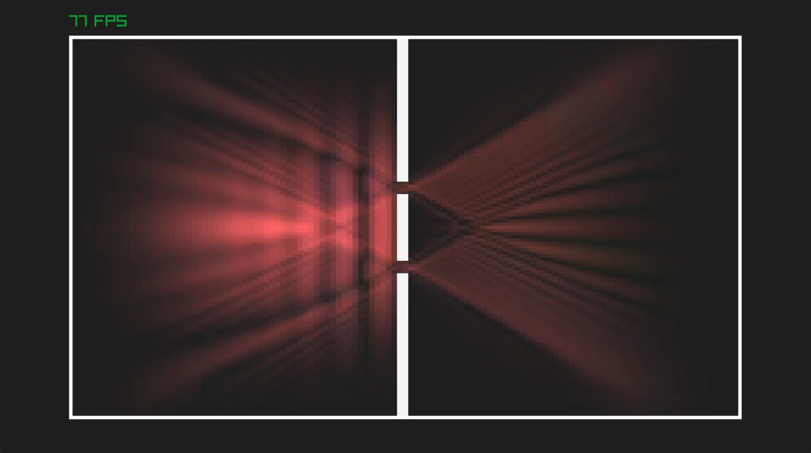

# Solving the Schrödinger equation for a double slit using C++, Raylib and the Crank-Nicolson algorithm

 
This was one of the very first C++ project, that I brushed up. 
To be improved:

* Using raylib-cpp rather than Raylib
* Using the raylib.camera rather than hard coding the double-slit positions
* notiations need to be made more uniform

To understand the algorithm, please have a look at [Arturo Mena](https://artmenlope.github.io/solving-the-2d-schrodinger-equation-using-the-crank-nicolson-method/)'s excellent python tutorial! 

